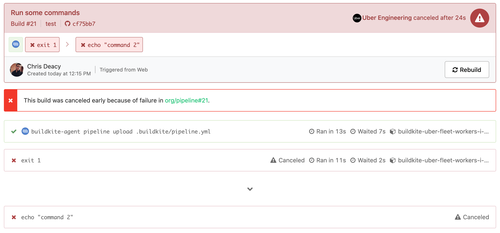

# bail-early-buildkite-plugin

> If any jobs or triggered builds fail, cancel the parent build immediately



## Usage

1. Provide a Buildkite token with graphql and `write_builds` access via a `BUILDKITE_TOKEN` environment variable

2. Add the plugin to your steps:

```yaml
steps:
  - command: 'echo hi'
    plugins:
      - 'uber-workflow/bail-early#master': ~
```

Any step using this plugin will cause the parent build to bail with an annotation linking to the failed job.

If this plugin is used in a build triggered by a [trigger step](https://buildkite.com/docs/pipelines/trigger-step), it will bail the parent build it was triggered from and add the annotation there instead.

## Configuration

If you need to limit when the plugin is enabled, you can use the `if` parameter. Its value is eval'd in a bash conditional (e.g. `if [ <your value here> ]; then...`)

```yaml
steps:
  - command: 'echo hi'
    plugins:
      - 'uber-workflow/bail-early#master':
        if: '"$SHOULD_BAIL_EARLY" = "true"'
```
